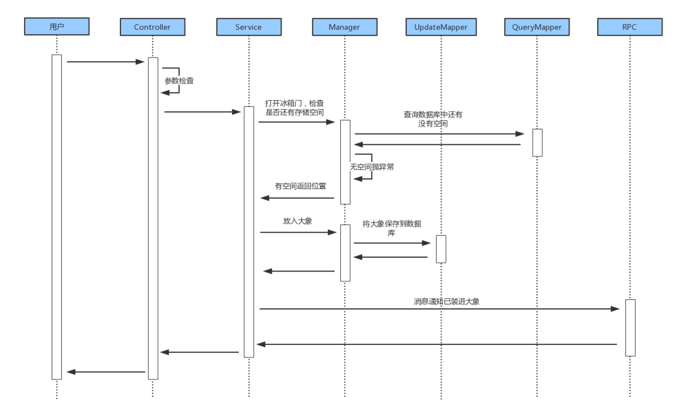

# 如何做好一个后端项目
[](https://travis-ci.org/1991wangliang/springboot-demo)
[](https://codecov.io/gh/1991wangliang/springboot-demo)

什么样的项目是一个好的项目,如何做好一个项目？这个问题我考虑过很久，由于之前一直做项目外包，也接触到的了比较多的项目，但是我一直没有感觉到自己做过的哪个项目是可以称为好项目，我提交的这份代码，或许也是很多研发人员开发业务的风格。

慢慢接触到领域模型之后，有些体会。先总结一句话:颗粒度越大(代码量越大)，功能调整的可能性就会越大，出现BUG的可能性也会越大，时刻要尽一切办法去减小颗粒度，这也将会驱使你不断进步。
 
## 系统介绍

层次介绍:    
Controller    负责完成对数据的非业务性校验，Controller层直接调用Service层。    
Service       负责完成业务的实现，项目在前期比较没有特别复杂的逻辑时候，可以先通过Service直接实现业务(业务代码在100行以内)，代码量增加就需要考虑采用领域模型来处理业务了。    
Domain        负责领域业务处理，领域模型将随着业务的不断扩展而不断的下沉抽离，前期的领域可能不能算做是严格意义上的领域，可算作为业务步骤抽离。   
DB            负责数据操作，为了将来的维护优化可将读写分离。    

本代码以把大象放进冰箱功能为例，详细展示了各个模块的业务控制。


## 关于敏捷开发
敏捷开发的关键是：阶段性发布可用功能版本，长期持续的推进项目进度。其实还是比较好理解的，但是如何才能做好呢？实际上很多项目的研发过程就像是在垒扑克牌，一对一对的垒，越垒越高，在垒到足够高的时候，去调整一个小功能时却导致了整盘的倒塌。但是再回过头来看垒扑克牌的过程时，你却会觉得自己是采用了敏捷开发啊，也确实是一个迭代一个迭代的垒的啊。
```
       /\
      /\/\                /\
     /\/\/\      /\      /\/\
    /\/\/\/\    /\/\    /\/\/\
   /\/\/\/\/\  /\/\/\  /\/\/\/\
  /\/\/\/\/\/\/\/\/\/\/\/\/\/\/\
 /\/\/\/\/\/\/\/\/\/\/\/\/\/\/\/\
/\/\/\/\/\/\/\/\/\/\/\/\/\/\/\/\/\
```


## 一个好的后端项目指标

* 有良好的代码规范
    1. 良好的代码风格
    2. 良好的注释规范
* 有完善的资料与文档
    1. 业务流程文档
    2. 架构设计文档
    3. 实现流程文档
* 项目功能与业务相匹配
    1. 测试用例与功能相符
    2. 单元测试与业务相符
    3. 可通过单元测试与功能测试
* 达到系统性能要求
    1. 评估满足用户的性能要求
    2. 压测可满足预估的性能要求
    3. 系统性能可通过负载提升
* 采用成熟完善的技术与框架
    1. 成熟完善及使用者多文档全面
    2. 有良好的服务,出现问题可解决
* 拥有达标覆盖率的单元测试
    1. 确保业务代码可正常执行
    2. 不依赖其他模块或数据可独立运行
    3. 执行完成以后不产生脏数据
    4. 完成单元测试要对业务产生的影响做检查
    5. 单元测试可尽量覆盖所有的业务
* 他人可轻易的扩展维护
    1. 有良好的代码风格与注释
    2. 有相对完善的资料文档
    3. 有相对全面的单元测试
    4. 有良好的设计模式，可支持添加功能时尽量增加而不修改
 
## 开发规范要求

### 代码规范
[Google Java Code Style](https://blog.csdn.net/yuanmomoya/article/details/100100514)

###  注释要求

项目中着重需要在Service层以及Manager层写清楚业务执行的逻辑注释。对业务流程比较复杂的可以通过列步骤来说,1、2、3..

DemoService层代码示例如下:
```java
  /**
   * 将大象放进冰箱
   * 1、找到冰箱的有效空间
   * 2、将大象存进冰箱
   * 3、通知消息已存放成功
   * 
   * @param req 大象
   * @return  大象所在位置
   */
  @Override
  @Transactional
  public AnimalRes put(AnimalReq req) {
    String name = req.getName();

    //放进大象 对应操作是将大象存到冰箱空间里面
    int id =refrigeratorManager.putAnimal(name);

    //关闭冰箱 对应操作是提交事务，实际本地事务已提交,这里就换成发送一条通知消息
    messageClient.send(MsgReq.create(id,name));

    return AnimalRes.ok(id);
  }
  
```

Manager层代码示例如下:
```java
  /**
   * 查找冰箱的余留位置
   * @return  可存放的空间
   */
  public Refrigerator findSpace() {
    Refrigerator refrigerator = refrigeratorQuery.findSpace();
    if (refrigerator == null) {
      throw new RuntimeException("抱歉冰箱已经满了.");
    }
    return refrigerator;
  }


  /**
   * 保存动物到冰箱
   * 1、先从冰箱中找到一个位置
   * 2、然后将动物保存到冰箱中
   * @param name  动物名称
   * @return  格栅Id
   */
  public int putAnimal(String name) {
    //打开冰箱 对应操作是找到一个存储大象的空间
    Refrigerator refrigerator =  findSpace();
    //放进大象 对应操作是将大象存到冰箱空间里面
    refrigeratorMapper.updateValue(name, new Date(), refrigerator.getId());

    //返回格栅Id
    return refrigerator.getId();
  }
```

### 层次划分要求
  
Controller 层:   
  负责完成对数据的非业务性校验，Controller层只可以做两种情况的业务调用:        
  一、在`@Configuration`中定义出来的匿名内部类形式的Controller，它可以直接对单表db层做调用，但是前提条件是该操作直接涉及到单领域内，且只有db层数据处理，无其他业务操作。    
  二、普通class类下的Controller，它可以调用业务层的Service，来完成业务的调用。      
      
Service 层:     
 负责完成业务的实现:   
 
      
Manager 层:    
   是指具体业务模块的业务逻辑控制，可理解为是模块或者领域的概念，每一个Manger会明确其管理的资源数据，通过bean注入的方式约定，在分布式系统中RPC层在该架构中相当于Manager层。层次划分规范:   
 一、每个领域有明确的资源范围，在领域确定后不允许为了方便实现功能而夸领域访问其他资源,领域内部需要做数据关联查询时，不允许夸领域查询，领域与领域下的数据可以理解为是分布式的。   
 二、领域是完成业务中具体功能的实现，在Service层不允许出现两次调用同一个Manager层的访问，若出现则需要将这两次连续的调用放在一个Manager业务中完成其业务。   
 三、领域层随着业务的不断庞大以后可对领域做继续划分，划分为子领域。当划分彻底以后对应这个Manager层可以做为Service层使用，也可以理解为大领域。        

DB 层:       
  数据层为了将来的数据优化，分为读，写两种不同的操作，考虑到现有的技术目前分为基于mybatis的Mapper Query,和Jpa对应的JpaRepository,两种不同的实现。由于不同的数据存储方式，固规定上只分为读写两种不同的业务，不限制技术。   
   


