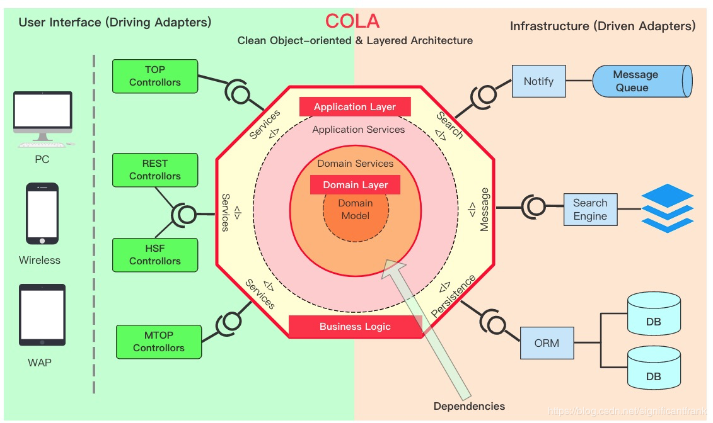
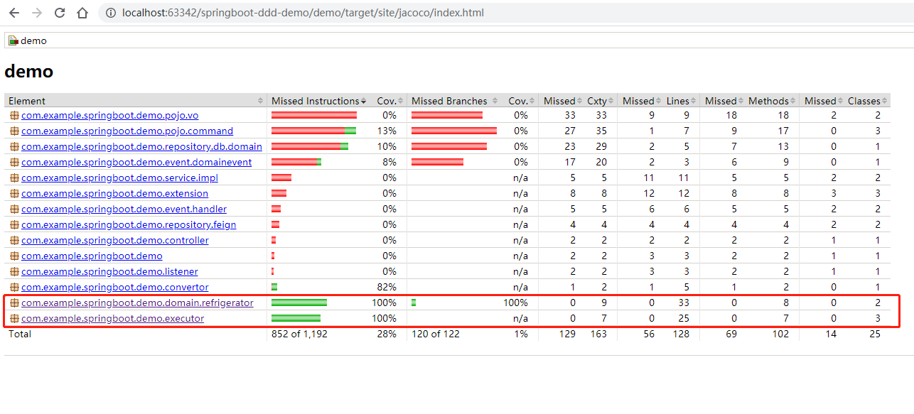

# 如何做好一个后端项目
[](https://travis-ci.org/1991wangliang/springboot-demo)
[](https://codecov.io/gh/1991wangliang/springboot-demo)

[B站视频课程](https://www.bilibili.com/video/BV1ZA411i7M7?spm_id_from=333.999.section.playall&vd_source=777e9b5e0c02b3bdc8b1723b7ccd6626)   
🌟🌟🌟  https://github.com/codingapi/springboot-framework Springboot 领域驱动开发框架   

什么样的项目是一个好的项目,如何做好一个项目？这个问题我考虑过很久，由于之前一直做项目外包，也接触到的了比较多的项目，但是我却从没有感觉到哪一个项目可以让自己感到非常满意，当然做好项目不仅仅单是技术层面的考虑，还需要考虑到与客户的配合、功能的梳理、团队的配合、公司的考核晋升体系等等一系列的问题，我们今天先只从技术层面出发来考虑如何做好一个后端项目。

在我慢慢看清楚领域模型之后，才有了些体会。先说一下我对领域模型的认识:领域模型实际上就是尽可能的引用类去解决问题，而不是函数，也就是朝着面向对象的方向看齐。这样做当然是对的，但却引发了一个新的问题就是如何划分类与类的职责？实际上划分职责的过程就是领域设计的过程。
下面是我对软件系统的认识:颗粒度越大(函数方法代码量越多)，功能调整的可能性就会越大，出现BUG的可能性也会越大，要时刻想尽一切办法去减小颗粒度，减小颗粒度不是让把100行的方法改成两个50行的方法，而是要用类去解决问题，这也将会驱使你不断进步。

## 领域模型、贫血模型、充血模型概念总结
领域模型是对领域内的概念类或现实世界中对象的可视化表示。又称概念模型、领域对象模型、分析对象模型。它专注于分析问题领域本身，发掘重要的业务领域概念，并建立业务领域概念之间的关系。    
业务对象模型（也叫领域模型domain model）是描述业务用例实现的对象模型。它是对业务角色和业务实体之间应该如何联系和协作以执行业务的一种抽象。业务对象模型从业务角色内部的观点定义了业务用例。该模型为产生预期效果确定了业务人员以及他们处理和使用的对象（“业务类和对象”）之间应该具有的静态和动态关系。它注重业务中承担的角色及其当前职责。这些模型类的对象组合在一起可以执行所有的业务用例。    
[领域模型、贫血模型、充血模型概念总结](https://blog.csdn.net/u010955843/article/details/45337771)   
[复杂业务代码要怎么写](https://blog.csdn.net/significantfrank/article/details/98087611)  
[分离业务逻辑和技术细节](https://blog.csdn.net/significantfrank/article/details/94593620)    


## 关于敏捷开发
敏捷开发的关键是：阶段性发布可用功能版本，长期持续的推进项目进度。其实是比较好理解的，但是如何才能确保做好呢？实际上很多项目的研发过程就像是在垒扑克牌，一对一对的垒，越垒越高，在垒到足够高的时候，去调整一个小功能时却导致了整盘的倒塌，敏捷并不是把控好项目的根本，敏捷推进项目的一种方式。
```
       /\
      /\/\                /\
     /\/\/\      /\      /\/\
    /\/\/\/\    /\/\    /\/\/\
   /\/\/\/\/\  /\/\/\  /\/\/\/\
  /\/\/\/\/\/\/\/\/\/\/\/\/\/\/\
 /\/\/\/\/\/\/\/\/\/\/\/\/\/\/\/\
/\/\/\/\/\/\/\/\/\/\/\/\/\/\/\/\/\
```


## 一个好的后端项目指标

* 有良好的代码规范
    1. 良好的代码风格
    2. 良好的注释规范
* 有完善的资料与文档
    1. 业务流程文档
    2. 架构设计文档
    3. 实现流程文档
* 项目功能与业务相匹配
    1. 测试用例与功能相符
    2. 单元测试与业务相符
    3. 可通过单元测试与功能测试
* 达到系统性能要求
    1. 评估满足用户的性能要求
    2. 压测可满足预估的性能要求
    3. 系统性能可通过负载提升
* 采用成熟完善的技术与框架
    1. 成熟完善及使用者多文档全面
    2. 有良好的服务,出现问题可解决
* 拥有达标覆盖率的单元测试
    1. 确保业务代码可正常执行
    2. 不依赖其他模块或数据可独立运行
    3. 执行完成以后不产生脏数据
    4. 完成单元测试要对业务产生的影响做检查
    5. 单元测试可尽量覆盖所有的业务
* 他人可轻易的扩展维护
    1. 有良好的代码风格与注释
    2. 有相对完善的资料文档
    3. 有相对全面的单元测试
    4. 有良好的设计模式，可支持添加功能时尽量增加而不修改
 
 
## 做好项目的基本要素

要时刻提醒自己: 看清目标,掌握好方向。

* 努力的方向
  1. 颗粒度越大(函数代码量越大)，功能调整的可能性就会越大，出现BUG的可能性也会越大，时刻要想尽一切办法去减小颗粒度，这也将会驱使你不断进步。           
* 努力的目标  
  1. 既开闭原则,最终实现在扩展功能时，做到只增加而不修改。   

有了目标和方向了，你还不知从何下手？        
首先要先摆脱函数式编程，开始拥抱面向对象，要准守规范与原则，拒绝CV战士。为什么这样呢？若不懂的话请先看下[领域模型、贫血模型、充血模型概念总结](https://blog.csdn.net/u010955843/article/details/45337771) ，若还不懂，却依旧渴望真理的话，那请提交issue留言，我可以专门做个视频讲讲为什么。   


 
## COLA架构系统介绍



本项目基于[springboot领域驱动框架](https://github.com/codingapi/springboot-framework)开发

层次介绍:      

|  层次    | 说明  |
|  :----  | :----  |
| controller  |  提供服务的访问层，目前采用RestController的方式，也做基础数据格式校验的业务。  |
| service  |  对应上图中的services部分，主要做4类事情:1、开启事务与事务消息，2、适配并调用Executor层，3、业务拓展，4、多个Executor的编排组装。 |
| convertor  | 适配层，适配层的存在也是为了避免各层次间的强依赖,为了更清新的划分清楚层次，如command对象将不直接依赖vo对象，而是通过convertor或构造数据做适配 |
| executor  | 具体业务命令的逻辑编排与执行，这是业务逻辑处理的关键地方,遵循CQRS分为Command与Query，executor是资源层的操控者。|
| extension  | 业务扩展层，可扩展多种业务实现，COLA提供了全局的策略规范。extension会在service层被调用 |
| domain  | 洋葱图的核心部分:领域层，domain领域可细分为model与service(action)|
| event  | event在架构图中属于资源层，event作为解耦系统的耦合度起到了非常关键的作用，同时也为解决事务问题提供了标准 |
| pojo  | 数据dto对象，分为command/vo/co/ao... 等不同的dto对象  |
| repository  | 资源层相对来说比较广泛，最基本的是对db的操作，对其他模块的操作(feign)，对搜索引擎或消息队列的操作都属于资源。可细分为:feign、db、search、message  | 
            
本项目功能:把大象放进冰箱，本项目的代码是我刚开始上路的起步阶段，还有很多不足，大家仅做参考。各层次的详细介绍可参考每一层中的package-info.java下的内容。             

### 我的落地方式  
我对领域的理解从刚开始的探索，到慢慢在实际项目中使用有经历了一段时间。COLA框架实际上融合了很多东西，落地项目需要从这几步开始。

* 业务功能需求梳理    
根据业务功能需求，分析系统中的用例，并画出各个用例的业务关键流程图，流程图中只关心影响业务走向的动作。    
* 业务建模与划分    
划分业务领域以及业务建模，业务建模我们采用的是[四色建模法](https://blog.csdn.net/phenixIII/article/details/16341389?depth_1-utm_source=distribute.pc_relevant.none-task&utm_source=distribute.pc_relevant.none-task)      
* 接口与数据库设计     
根据界面设计定义出来接口，并完成数据库设计。            
* 业务功能编写     
编写业务逻辑代码.    
* 领域单元测试     
编写领域逻辑的单元测试,业务逻辑代码是需要从controller的参数接受一直到数据的返回，但是容易出现问题的地方，恰恰不是数据请求的传递与数据的落库操作，而是控制数据的逻辑，也就是domain层的代码了。

划分业务线的原理:         
四色建模法会帮助我们梳理出来业务的关键时刻，这些是系统的核心业务，我们也直接将根据四色建模法来定义领域对象。但是在实际项目开发过程中，我们还会在做一步:“划分业务线”。这也是非常重要的一步，他将影响到业务的实现方式。
划分业务线是为了梳理业务功能。executor作为业务的编排逻辑，在处理业务的时候需要明确其边界。一个系统中的业务，可以分为三大类:核心业务、延伸业务、基础数据业务。举例来说一个交易的商城业务中，通常会将订单业务作为核心业务，订单触发的物流派单业务属于延伸业务，订单中商品及用户数据的维护称为基础数据业务，当然一个系统中可以存在多个核心业务。
划分业务类型的主要意义是为了解耦业务线，这里通常是采用事件的方式来解耦，例如订单完成以后将发送一个订单完成事件来触发订单后面的业务，在这里订单逻辑与延伸业务是不在一块执行的。这样做可以开发起来更简单明确同时也提供了更好的业务拓展能力。

Executor的注意事项:
* 根据CQRS会区分为Command与Query两种不同类型的指令。
* Executor层可操作的对象有:领域对象、资源对象，仅此两类不允许做其他的资源调用，资源对象有:事件机制、数据资源、缓存资源。
* Executor层主要负责业务的编排，业务的细节在领域层处理。(场景举例:老板安排你来打扫卫生，老板主要是下达命令的，实际打扫卫生是应该有你来做，你不能把打扫工具给老板，让他去完成打扫卫生的动作)
* 定义了业务线的划分以后，会存在特殊的业务资源用于Executor层中。(场景举例：订单支付可采用信用支付，信用业务不在订单业务线下，在订单支付的时候需要判断信用情况，在此信用支付时将可让信用模块以资源的方式提供支持)

关于单元测试的建议:    
首先可参考COLA MOCK的方式来实现单元测试业务。我们实际采用的方式则是分开来测试，区分资源测试与逻辑测试。逻辑测试是只针对Executor层做单元测试，Executor层是业务的编排逻辑，对Executor测试可直接覆盖业务，
当然由于Executor层也引用了资源，对资源的引用时可直接采用mock的方式来处理，具体细节可参考demo下的单元测试代码。若需要对资源层做测试则直接跑资源层的测试代码即可，我觉得这个比较简单大多都是SQL层面的测试，然后再加一个全局事务回滚即可，这里的测试只关系资源不关心业务。
总之我们将测试分开来做分为资源测试与逻辑测试。针对代码的覆盖率检查可通过jacoco插件查看。

     

给大家的建议:    
* 规范非常重要，统一的规范可以不仅可以提高整体的易读性，还会提高代码的复用性。举例来说多人在协作开发时若规范不统一，可能会出现相同业务的代码两个人各写一份，不仅浪费了时间还降低了系统的复用度，若规范统一就能避免很多这类事情。      
* 层次的分明是件非常重要的事情，他将会帮助你细分颗粒度，就好比是垃圾分类一样，它会让你清楚的将每段代码扔到不同的桶中，也是达到“让上帝的归上帝,凯撒的归凯撒”的根本。    
* 要学会用类去实现业务，而不是以面向过程式的函数去实现功能，以类实现功能你将会更容易的去细分颗粒度，也会让复杂的业务简单化。      
* 当你慢慢习惯了以上三条建议以后，还需要多多品味我下文中提到那些设计模式的原则，他将会让你更加清晰的去定义一个类的功能职责。    

谈谈落地后的优势:          
* 高复用的代码     
代码复用的地方特别多大的颗粒度来说,service层对Executor的复用，通过Event复用Executor，再就是Executor中对Domain层的复用。当你做好了以后你会发现同样的业务逻辑绝不会写两次。     
* 清晰逻辑    
实现功能的代码可以有很多种，面向过程也能做完功能。逻辑的清晰不仅仅是建立在代码规范与注释上的，还有一个非常重要的点就是层次的划分上。我经常拿打扫卫生来说事情，我觉得打扫干净屋子这件事情，需要从两个维度来看。1是整洁，2是归类。只有两点都做到才会给人一种干净且舒服的感觉     
* 业务拓展     
业务的拓展性，也不仅仅是指能加上就代表拥有拓展性，而更注重的时解耦。首先COLA提供了场景拓展的支持，再就是由于清晰逻辑、业务主次分明、事件机制的解耦、高复用的逻辑，让你对功能的调整变的极其简单。     
* 性能拓展     
性能往往分为两种情况，1是访问量上升的压力，2是系统性能的瓶颈。针对1的情况可采用分布式部署技术来解决，针对2的情况可直接通过CQRS，通过Event及Cache对Query做优化。      
* 事务问题    
事务问题是在分布式以后才存在的，事务分为两类：一类是横向的业务事务问题，第二类是纵向的拓展业务事务。对于一类的事务只能采用分布式事务框架来解决可参考[LCN6.0](https://github.com/codingapi/tx-lcn),对于第二类的事务可采用事务消息队列来处理。    
* 自动化部署    
自动化部署当然今天已经有非常成熟各种CI/CD技术了，但是自动化部署的难点是如何保证本次部署的业务不存在较大逻辑问题？实际上也就是单元测试的落地了。    

参考:    
[四色建模](https://blog.csdn.net/phenixIII/article/details/16341389?depth_1-utm_source=distribute.pc_relevant.none-task&utm_source=distribute.pc_relevant.none-task)   
[CQRS](http://blog.maxkit.com.tw/2018/05/)    
[读写分离到CQRS](https://www.jianshu.com/p/1b82a1f6a586)   
[领域驱动设计DDD和CQRS落地](https://www.jianshu.com/p/Tozpp3)    
[代码精进之路 从码农到工匠](https://item.jd.com/12612417.html)

## 遵守的原则

[软件设计模式概述](http://c.biancheng.net/view/1317.html)

### 开闭原则的定义
开闭原则（Open Closed Principle，OCP）由勃兰特·梅耶（Bertrand Meyer）提出，他在 1988 年的著作《面向对象软件构造》（Object Oriented Software Construction）中提出：软件实体应当对扩展开放，对修改关闭（Software entities should be open for extension，but closed for modification），这就是开闭原则的经典定义。    

这里的软件实体包括以下几个部分：   
项目中划分出的模块   
类与接口   
方法    

开闭原则的含义是：当应用的需求改变时，在不修改软件实体的源代码或者二进制代码的前提下，可以扩展模块的功能，使其满足新的需求。   
开闭原则的作用    
开闭原则是面向对象程序设计的终极目标，它使软件实体拥有一定的适应性和灵活性的同时具备稳定性和延续性。具体来说，其作用如下。    
1. 对软件测试的影响
软件遵守开闭原则的话，软件测试时只需要对扩展的代码进行测试就可以了，因为原有的测试代码仍然能够正常运行。
2. 可以提高代码的可复用性
粒度越小，被复用的可能性就越大；在面向对象的程序设计中，根据原子和抽象编程可以提高代码的可复用性。
3. 可以提高软件的可维护性
遵守开闭原则的软件，其稳定性高和延续性强，从而易于扩展和维护。

### 里氏替换原则

里氏替换原则（Liskov Substitution Principle，LSP）由麻省理工学院计算机科学实验室的里斯科夫（Liskov）女士在 1987 年的“面向对象技术的高峰会议”（OOPSLA）上发表的一篇文章《数据抽象和层次》（Data Abstraction and Hierarchy）里提出来的，她提出：继承必须确保超类所拥有的性质在子类中仍然成立（Inheritance should ensure that any property proved about supertype objects also holds for subtype objects）。     

里氏替换原则主要阐述了有关继承的一些原则，也就是什么时候应该使用继承，什么时候不应该使用继承，以及其中蕴含的原理。里氏替换原是继承复用的基础，它反映了基类与子类之间的关系，是对开闭原则的补充，是对实现抽象化的具体步骤的规范。    
里氏替换原则的作用    
里氏替换原则的主要作用如下。    
1. 里氏替换原则是实现开闭原则的重要方式之一。
2. 它克服了继承中重写父类造成的可复用性变差的缺点。
3. 它是动作正确性的保证。即类的扩展不会给已有的系统引入新的错误，降低了代码出错的可能性。

### 依赖倒置原则

依赖倒置原则（Dependence Inversion Principle，DIP）是 Object Mentor 公司总裁罗伯特·马丁（Robert C.Martin）于 1996 年在 C++ Report 上发表的文章。    

依赖倒置原则的原始定义为：高层模块不应该依赖低层模块，两者都应该依赖其抽象；抽象不应该依赖细节，细节应该依赖抽象（High level modules shouldnot depend upon low level modules.Both should depend upon abstractions.Abstractions should not depend upon details. Details should depend upon abstractions）。其核心思想是：要面向接口编程，不要面向实现编程。   

依赖倒置原则是实现开闭原则的重要途径之一，它降低了客户与实现模块之间的耦合。    

由于在软件设计中，细节具有多变性，而抽象层则相对稳定，因此以抽象为基础搭建起来的架构要比以细节为基础搭建起来的架构要稳定得多。这里的抽象指的是接口或者抽象类，而细节是指具体的实现类。    

使用接口或者抽象类的目的是制定好规范和契约，而不去涉及任何具体的操作，把展现细节的任务交给它们的实现类去完成。     
依赖、倒置原则的作用    
依赖倒置原则的主要作用如下。   
1. 依赖倒置原则可以降低类间的耦合性。
2. 依赖倒置原则可以提高系统的稳定性。
3. 依赖倒置原则可以减少并行开发引起的风险。
4. 依赖倒置原则可以提高代码的可读性和可维护性。

### 单一职责原则
单一职责原则（Single Responsibility Principle，SRP）又称单一功能原则，由罗伯特·C.马丁（Robert C. Martin）于《敏捷软件开发：原则、模式和实践》一书中提出的。这里的职责是指类变化的原因，单一职责原则规定一个类应该有且仅有一个引起它变化的原因，否则类应该被拆分（There should never be more than one reason for a class to change）。     

该原则提出对象不应该承担太多职责，如果一个对象承担了太多的职责，至少存在以下两个缺点：   
一个职责的变化可能会削弱或者抑制这个类实现其他职责的能力；    
当客户端需要该对象的某一个职责时，不得不将其他不需要的职责全都包含进来，从而造成冗余代码或代码的浪费。   
单一职责原则的优点    
1. 单一职责原则的核心就是控制类的粒度大小、将对象解耦、提高其内聚性。如果遵循单一职责原则将有以下优点。
2. 降低类的复杂度。一个类只负责一项职责，其逻辑肯定要比负责多项职责简单得多。
3. 提高类的可读性。复杂性降低，自然其可读性会提高。
4. 提高系统的可维护性。可读性提高，那自然更容易维护了。
5. 变更引起的风险降低。变更是必然的，如果单一职责原则遵守得好，当修改一个功能时，可以显著降低对其他功能的影响。

### 接口隔离原则

接口隔离原则（Interface Segregation Principle，ISP）要求程序员尽量将臃肿庞大的接口拆分成更小的和更具体的接口，让接口中只包含客户感兴趣的方法。    

2002 年罗伯特·C.马丁给“接口隔离原则”的定义是：客户端不应该被迫依赖于它不使用的方法（Clients should not be forced to depend on methods they do not use）。该原则还有另外一个定义：一个类对另一个类的依赖应该建立在最小的接口上（The dependency of one class to another one should depend on the smallest possible interface）。    

以上两个定义的含义是：要为各个类建立它们需要的专用接口，而不要试图去建立一个很庞大的接口供所有依赖它的类去调用。    

接口隔离原则和单一职责都是为了提高类的内聚性、降低它们之间的耦合性，体现了封装的思想，但两者是不同的：   
1. 单一职责原则注重的是职责，而接口隔离原则注重的是对接口依赖的隔离。
2. 单一职责原则主要是约束类，它针对的是程序中的实现和细节；接口隔离原则主要约束接口，主要针对抽象和程序整体框架的构建。 
接口隔离原则的优点     
接口隔离原则是为了约束接口、降低类对接口的依赖性，遵循接口隔离原则有以下 5 个优点。     
1. 将臃肿庞大的接口分解为多个粒度小的接口，可以预防外来变更的扩散，提高系统的灵活性和可维护性。
2. 接口隔离提高了系统的内聚性，减少了对外交互，降低了系统的耦合性。
3. 如果接口的粒度大小定义合理，能够保证系统的稳定性；但是，如果定义过小，则会造成接口数量过多，使设计复杂化；如果定义太大，灵活性降低，无法提供定制服务，给整体项目带来无法预料的风险。
4. 使用多个专门的接口还能够体现对象的层次，因为可以通过接口的继承，实现对总接口的定义。
5. 能减少项目工程中的代码冗余。过大的大接口里面通常放置许多不用的方法，当实现这个接口的时候，被迫设计冗余的代码。

### 迪米特法则
迪米特法则（Law of Demeter，LoD）又叫作最少知识原则（Least Knowledge Principle，LKP)，产生于 1987 年美国东北大学（Northeastern University）的一个名为迪米特（Demeter）的研究项目，由伊恩·荷兰（Ian Holland）提出，被 UML 创始者之一的布奇（Booch）普及，后来又因为在经典著作《程序员修炼之道》（The Pragmatic Programmer）提及而广为人知。    

迪米特法则的定义是：只与你的直接朋友交谈，不跟“陌生人”说话（Talk only to your immediate friends and not to strangers）。其含义是：如果两个软件实体无须直接通信，那么就不应当发生直接的相互调用，可以通过第三方转发该调用。其目的是降低类之间的耦合度，提高模块的相对独立性。   

迪米特法则中的“朋友”是指：当前对象本身、当前对象的成员对象、当前对象所创建的对象、当前对象的方法参数等，这些对象同当前对象存在关联、聚合或组合关系，可以直接访问这些对象的方法。   
迪米特法则的优点     
迪米特法则要求限制软件实体之间通信的宽度和深度，正确使用迪米特法则将有以下两个优点。    
1. 降低了类之间的耦合度，提高了模块的相对独立性。
2. 由于亲合度降低，从而提高了类的可复用率和系统的扩展性。

但是，过度使用迪米特法则会使系统产生大量的中介类，从而增加系统的复杂性，使模块之间的通信效率降低。所以，在釆用迪米特法则时需要反复权衡，确保高内聚和低耦合的同时，保证系统的结构清晰。     

### 合成复用原则
合成复用原则（Composite Reuse Principle，CRP）又叫组合/聚合复用原则（Composition/Aggregate Reuse Principle，CARP）。它要求在软件复用时，要尽量先使用组合或者聚合等关联关系来实现，其次才考虑使用继承关系来实现。   

如果要使用继承关系，则必须严格遵循里氏替换原则。合成复用原则同里氏替换原则相辅相成的，两者都是开闭原则的具体实现规范。   
合成复用原则的重要性    
通常类的复用分为继承复用和合成复用两种，继承复用虽然有简单和易实现的优点，但它也存在以下缺点。   
1. 继承复用破坏了类的封装性。因为继承会将父类的实现细节暴露给子类，父类对子类是透明的，所以这种复用又称为“白箱”复用。
2. 子类与父类的耦合度高。父类的实现的任何改变都会导致子类的实现发生变化，这不利于类的扩展与维护。
3. 它限制了复用的灵活性。从父类继承而来的实现是静态的，在编译时已经定义，所以在运行时不可能发生变化。

采用组合或聚合复用时，可以将已有对象纳入新对象中，使之成为新对象的一部分，新对象可以调用已有对象的功能，它有以下优点。   
1. 它维持了类的封装性。因为成分对象的内部细节是新对象看不见的，所以这种复用又称为“黑箱”复用。
2. 新旧类之间的耦合度低。这种复用所需的依赖较少，新对象存取成分对象的唯一方法是通过成分对象的接口。
3. 复用的灵活性高。这种复用可以在运行时动态进行，新对象可以动态地引用与成分对象类型相同的对象。

*-------------------------------------希望这是一条你编程之路上的分界线--------------------------------------------*
